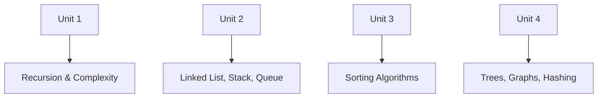
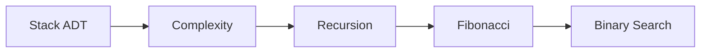
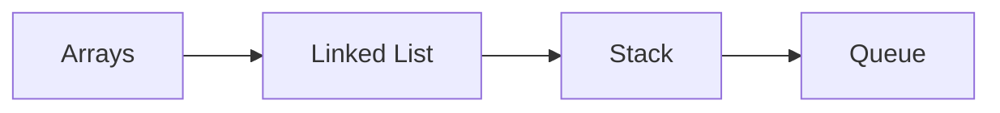
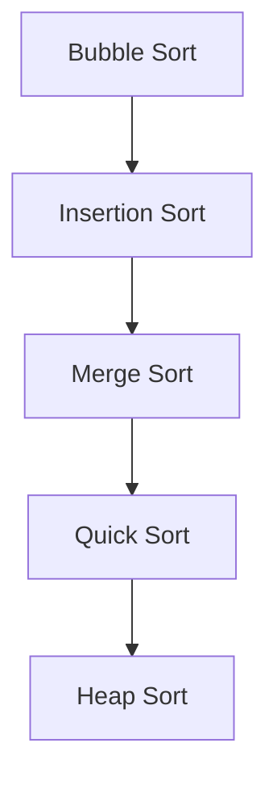
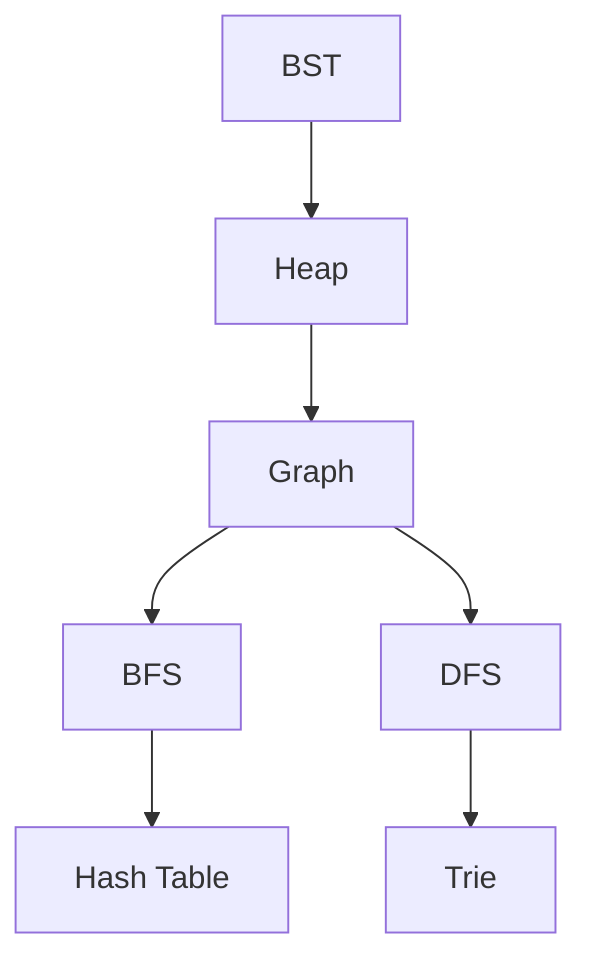

# 🔗 Repository

## [LAB-DS Repository](https://github.com/chandraprakashmishra18/LAB-DS.git)

---

# 🧠 Data Structures Lab (LAB-DS)

<p align="center">
  
</p>

> 📘 Complete implementation of **Data Structures Lab Experiments (Unit 1–4)**
> 🚀 Designed for **practical understanding + viva preparation**

---

# 🎬 Project Preview

<p align="center">
  
</p>

---

# 🏗️ Repository Architecture



---

# 📚 Units Covered

---

## 🔹 Unit 1: Foundations



### ✔ Concepts

* ADT (Stack)
* Time Complexity (Big-O, Theta)
* Recursion & Call Stack
* Fibonacci Optimization
* Binary Search

---

## 🔹 Unit 2: Linear Data Structures



### ✔ Concepts

* Arrays (1D, 2D)
* Dynamic Arrays
* Singly & Doubly Linked Lists
* Stack using Linked List
* Queue using Linked List

---

## 🔹 Unit 3: Sorting Algorithms



### ✔ Algorithms

* Bubble Sort
* Selection Sort
* Insertion Sort
* Merge Sort
* Quick Sort
* Heap Sort

---

## 🔹 Unit 4: Advanced Data Structures



### ✔ Concepts

* Binary Search Tree (BST)
* Heap / Priority Queue
* Graph (Adjacency List)
* BFS & DFS
* Hash Table (Chaining)
* Trie
* Bloom Filter

---

# ⚙️ Features

✨ Covers **entire DS syllabus (lab-wise)**
✨ Includes **code + logic + outputs**
✨ Structured for **easy viva revision**
✨ Industry-aligned concepts

---

# 📊 Complexity Overview

```mermaid
graph LR
A[Linear Search] --> O1[O(n)]
B[Binary Search] --> O2[O(log n)]
C[Sorting] --> O3[O(n log n)]
D[BFS/DFS] --> O4[O(V+E)]
```

---

# 🖥️ How to Run

```bash
git clone https://github.com/chandraprakashmishra18/LAB-DS.git
cd LAB-DS
python main.py
```

---

# 📁 Project Structure

```bash
LAB-DS/
│── Unit1/
│── Unit2/
│── Unit3/
│── Unit4/
│── main.py
│── README.md
```

---

# 📊 Sample Outputs

```text
Stack Push/Pop Operations
Sorted Array: [1, 2, 3, 5, 8]

BST Inorder: 20 30 40 50 60

BFS Traversal: A B C D
DFS Traversal: A B D C
```

---

# 🎯 Real-World Mapping

| Concept    | Application     |
| ---------- | --------------- |
| Stack      | Undo/Redo       |
| Queue      | Scheduling      |
| Graph      | Social Networks |
| Hash Table | Databases       |
| Trie       | Autocomplete    |

---

# 🔥 Why This Repo Matters

✔ Covers **complete lab manual**
✔ Helps in **viva + exams + interviews**
✔ Demonstrates **practical DS implementation**

---

# 🧑‍💻 Author

👤 **Chandra Prakash Mishra**
📘 Data Structures Lab Work

---

# ⭐ Support

```diff
+ ⭐ Star the repo
+ 🍴 Fork it
+ 📘 Use for exams & viva
```
